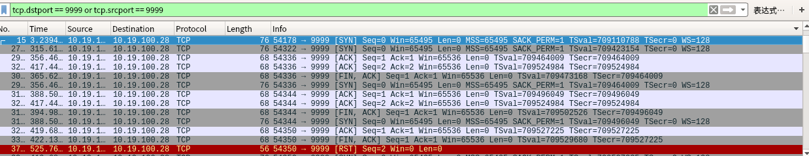
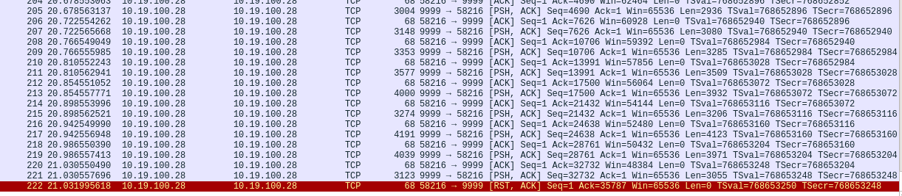

[toc]

####  Socket编程中的几点问题总结

#####  epoll_ctl中 epoll_event参数设置

* 对于 `EPOLLERR`和`EPOLLHUP`，不需要在epoll_event时针对fd作设置，一样也会触发；

* `EPOLLRDHUP`实测在对端关闭时会触发，需要注意的是：

  1. 对`EPOLLRDHUP`的处理应该放在`EPOLLIN`和`EPOLLOUT`前面，处理方式应该 是close掉相应的fd后，作其他应用层的清理动作；
  2. 如果采用的是LT触发模式，且没有close相应的fd, `EPOLLRDHUP`会持续被触发；
  3. `EPOLLRDHUP`想要被触发，需要显式地在`epoll_ctl`调用时设置在events中；
  4. 对端关闭包括：ctrl + c, kill, kill -9。

* 对于`EPOLLOUT`：

  1. 有写需要时才通过`epoll_ctl`添加相应fd，不然在LT模式下会频繁触发;
  2. 对于写操作，大部分情况下都处于可写状态，可先直接调用`write`来发送数据，直到返回 `EAGAIN`后再使能`EPOLLOUT`，待触发后再继续`write`。

#####  accept相关：

  * accept接收对端连接，会触载`EPOLLIN`, 这里可以循环多次调用`accept`,  直至返回 `EAGAIN`， 同时适用于LT和ET。

#####  对已经close的fd继续操作

* read: 返回-1, errno = 9, Bad file descriptor ;
* close: 同上；
* write:同上；

##### 如何判断对端关闭

* 优先使用上面介绍的`EPOLLRDHUP`; 
* 使用`EPOLLIN`， 然后调用`read`, 此时返回的ssize_t类型结果为0；
* 对端关闭包括：ctrl + c, kill, kill -9。

#####  对端正常 close时本端行为

这部分有些内容上面已阐述过，这里统一归纳一下。

* 对端close时，如果接收缓冲区内已无数据，则走tcp四次挥手流程，发送`FIN` 包，此时本端会触发事件如下：

  ```
  EPOLLRDHUP  （需要主动在epoll_ctal时加入events）
  EPOLLIN     
  EPOLLOUT    
  ```

  1. 此时应优先处理`EPOLLRDHUP`,它明确表明对端已经关闭，处理时close相应fd后，无需再继续处理其他事件；

  2. 如果不处理`EPOLLRDHUP`的话，也可以处理`EPOLLIN`事件，此时`read`返回0, 同样表明对端已经关闭；

  3. 如果以上两个事件都没有处理，而是在`EPOLLOUT`事件里又向fd写了数据，数据只是写入到本地tcp发送缓冲区，此时`write`调用会返回成功，但是紧接着` epoll_wait`又会返回如下事件组合：

     ```
     EPOLLERR    
     EPOLLHUP
     EPOLLIN     
     EPOLLOUT 
     POLLRDHUP  （需要主动在epoll_ctal时加入events）
     ```

     可以看到相比之前多了`EPOLLERR`和`EPOLLHUP`，是因为之前收到了对端close时发送的`FIN`  包，此时再给对端发送数据，对端会返回`RST`包。

     如果在收到`RST`包后，又向对端发送数据，会收到`sigpipe`异常，其默认处理是终止当前进程，此时可通过忽略此异常解决，忽略后`write`会返回-1, erron =32, Broken pipe:

     ```c
     signal(SIGPIPE, SIG_IGN);
     ```

     `Broker pipie`这个异常，说到底是应用层没有对相应的fd在收到对端关闭通知时，作正确的处理所致，它并不是tcp/ip通讯层面的问题。

  4. 下图可以看到发送了`FIN`包

  
  *  对端close（kill, kill -9）时，如果接收缓冲区内还有数据，不会发送`FIN`包，而是发送`RST`,此时本端：

    1. 收到`RST`后的第一次写操作，写失败，errno = 104,  Connection reset by peer; 之后将触发下列事件：

       ```
       EPOLLIN
       EPOLLOUT
       EPOLLHUP
       EPOLLRDHUP（需要主动在epoll_ctal时加入events）
       ```

       

    2. 收到`RST`后的第二次及后序的写操作，写失败，在忽略了`SIGPIPE`后，erron =32, Broken pipe；

    3. 收到`RST`后的读操作：errno = 104,  Connection reset by peer

    4. 下面可以看到发送了`RST`包：



##### 阻塞与非阻塞

* 针对Epoll的`LT`模式，socket fd可以设置成阻塞也可以设置成非阻塞；
* 针对Epoll的`ET`模式，socket fd只能设置成非阻塞；
  1. ET状态有变化才触发，因此在收数据时必须循环读取，收尽当前可收数据。因为不知道下一次调用`read`时还有没有数据，一旦没有数据，又没有用非阻塞方式，则将一直阻塞在`read`调用上；
  2. 当然如果在`LT`模式下也每次循环读取，也有类似的问题；
  3. 采用非阻塞循环读取方式时，如果当前socket fd上恰好有持续大数据量写入，则这个循环读取可能持续较长时间，从而导致其他socket fd上的读写操作将被延迟。针对这种情况，我们只能是控制当前socket fd上的读操作，并将其保存，在下一次event loop中不依赖`ET`的触发，直接针对保存的fd继续其读操作。

##### close行为

* close时，如果接收缓冲区还有数据未read到应用层，则不会走四次挥手流程，直接发`RST`包，这个前面已经介绍过；

* close时，如果发送缓冲区还有数据未发送，close立即返回，系统接管这个socket, 将尽力将发送缓冲区数据到对端，然后走发送`FIN`包；

* 使用`SO_LINGER`改变`close`默认行为：

  通过`struct linger`设置

  | linger.l_onoff | linger.l_linger | close行为                                                    | kernel行为                                                | 备注 |
  | -------------- | --------------- | ------------------------------------------------------------ | --------------------------------------------------------- | ---- |
  | 0 为 disable   | 忽略            | 立即返回,同close的默认行为                                   | 尽力将发送缓存区中数据发送到对端，然后发送FIN包，四次挥手 |      |
  | > 0 为enable   | 0               | 立即返回                                                     | 不走正常四次挥手，直接发送RST包，没有TIME_WAIT状态        |      |
  | > 0 为enbale   | 大于0           | 不管socket是否为blocking或noblocking, 都会阻塞直数据发送完成并收到对端的ACK, 或者linger.l_linger超时 | 如超时不走正常四次挥手，直接发送RST包，没有TIME_WAIT状态  |      |

  

